## QRabbit: QR Scanner & Creator

A modern, user-friendly, native Android application built in **Kotlin** with **Jetpack Compose**. It allows users to quickly and efficiently scan and generate QR codes, offering a seamless user experience with all the essential features.

## 📱 Features

* **Dual Scanner**: Read QR codes using the camera in real time or by selecting an image from the device.
* **Intelligent Detection**: Automatically recognizes different types of content in QR codes (URL, Wi-Fi, Email, Phone, Location and Plain Text).
* **Quick Actions**: Offers immediate contextual actions based on the type of QR code detected (open browser, connect to Wi-Fi, add contact, etc.).
* **QR Creator**: Generates QR codes for multiple purposes: URL, Wi-Fi, Email, Phone, Location, and Text.
* **Advanced Customization**: Allows you to customize the generated QR codes (colors, styles, etc.).
* **Scanned & Created History**: Keeps a complete record of both scanned and created QR codes for quick access.
* **Smart History Management**: Includes an interactive tutorial demonstrating **Swipe-to-Dismiss** gestures to easily archive or delete items from your scanned QR history.
* **Splash Screen**: Includes a Splash Screen with smooth animation.
* **TalkBack Support**: Optimized for accessibility.
* **Multiple languages supported**: The application is available in multiple languages: English, Spanish, Portuguese, Italian and French.

## 🛠️ Tech Stack

| Component                 | Technology                             |
|:--------------------------| :------------------------------------- |
| **UI**                    | Jetpack Compose                        |
| **Architecture**          | MVVM & Clean Architecture              |
| **Dependency Injection**  | Koin                                   |
| **Navigation**            | Compose Navigation                     |
| **Local Database**        | Room                                   |
| **Preferences**           | Jetpack DataStore                      |
| **Pagination**            | Paging3                                |
| **Camera**                | Camera X                               |
| **QR Detection**          | ML Kit                                 |
| **Image Loading**         | Coil                                   |
| **Monetization**          | Google AdMob                           |
| **Analytics**             | Firebase Analytics                     |
| **Crash Reporting**       | Firebase Crashlytics                   |

## 📸 Screenshots

| **No Camera Permission** | **Create QR - Types** | **Create QR - URL** |
|:---:|:---:|:---:|
| 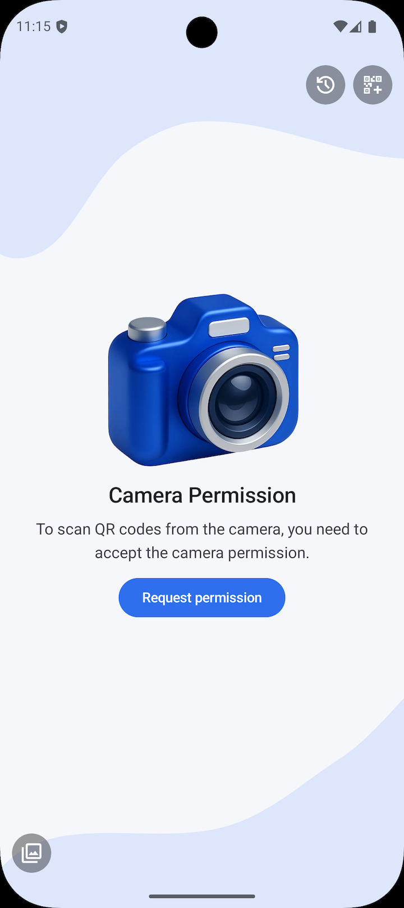 | 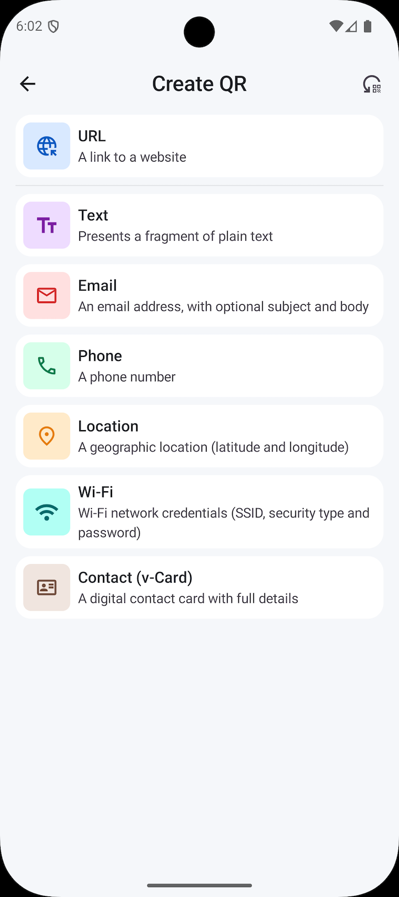 | 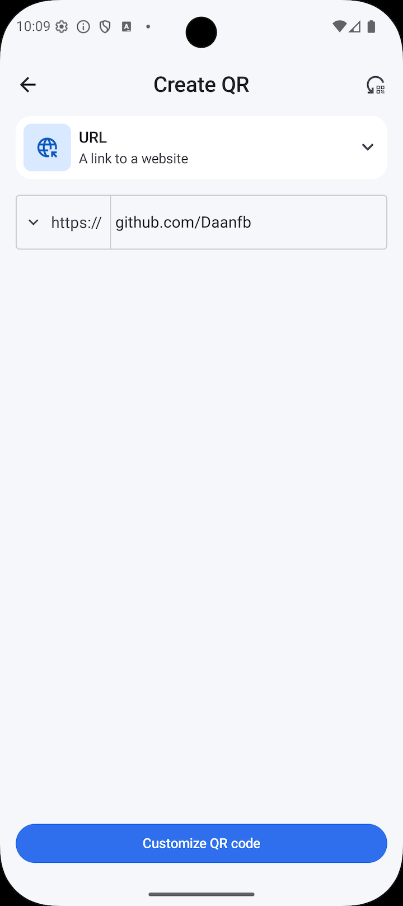 |
| **Customize QR - Initial** | **Customize QR - Background Color** | **Customize QR - QR not readable** |
| 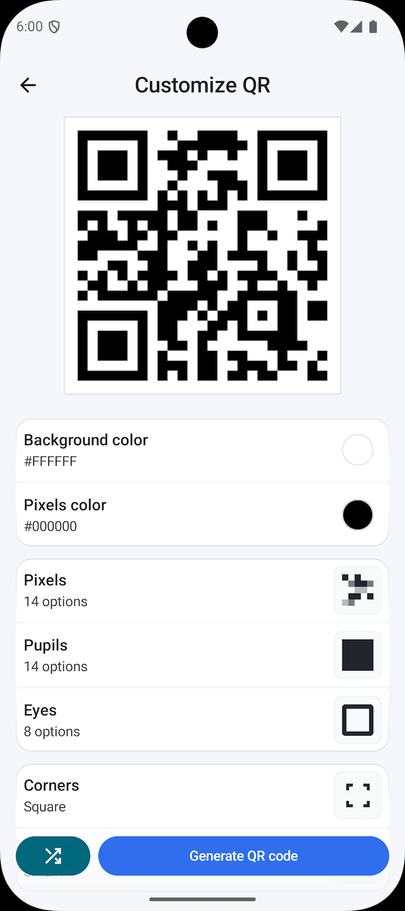 | 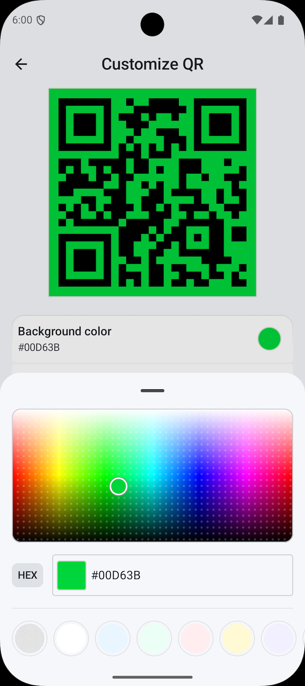 | 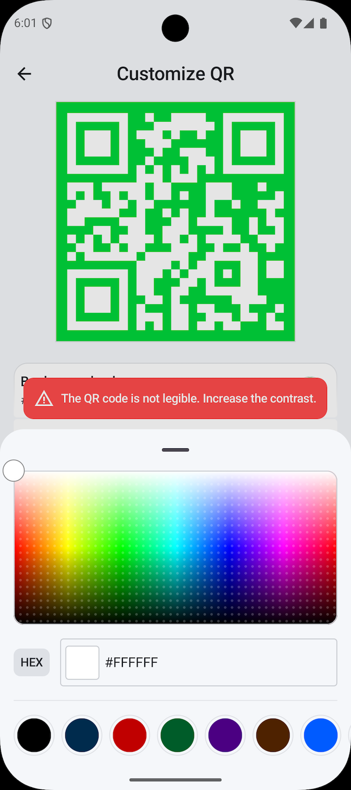 |
| **Customize QR - Pixels Shape** | **Customize QR - More Options** | **Share QR Screen** |
| 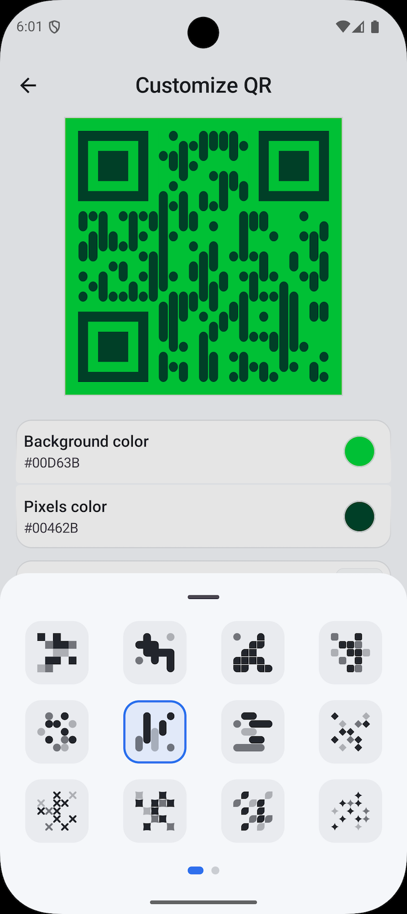 | 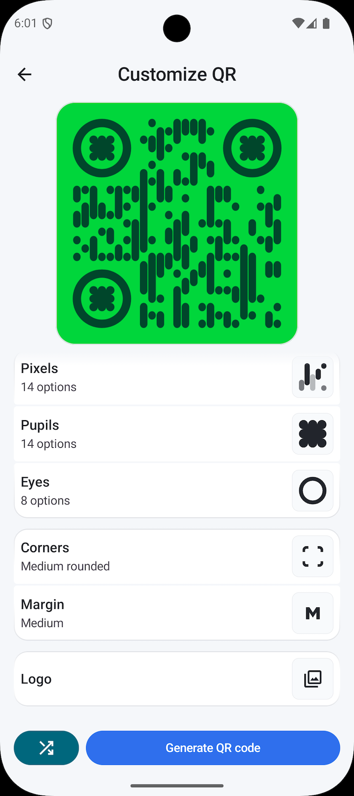 | 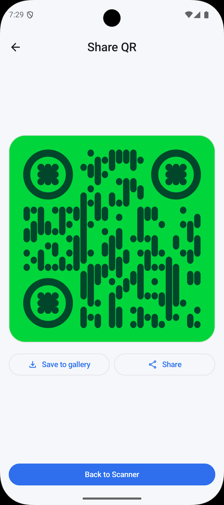 |
| **Save QR Bottom Sheet** | **Share QR (After click share button)** | **Scan Image From Gallery** |
| 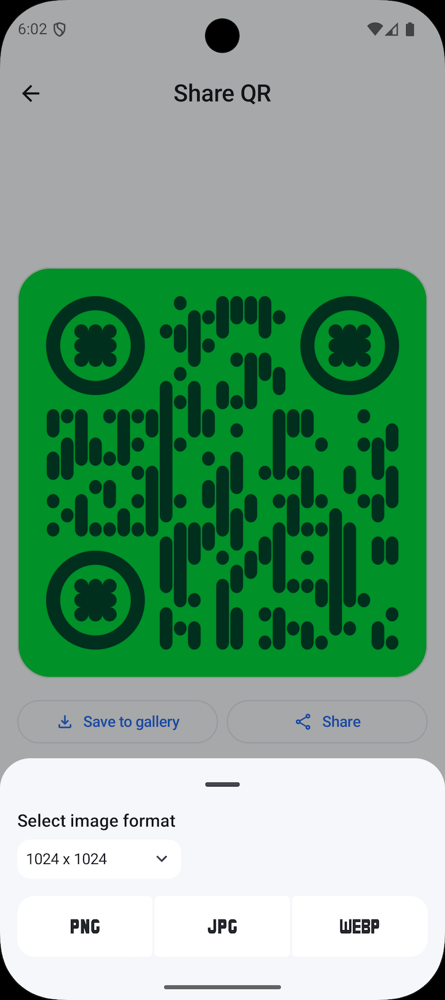 | 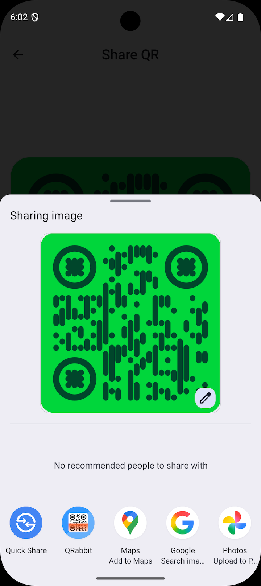 | 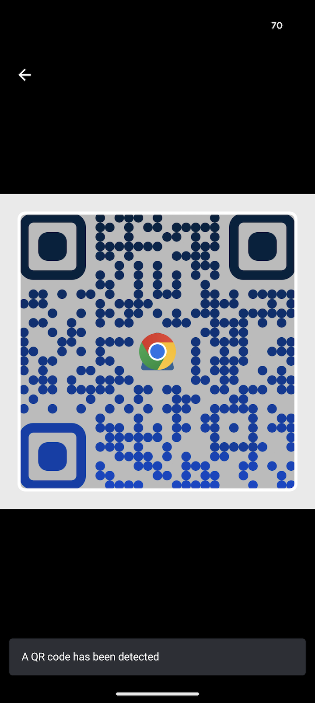 |
| **URL QR Actions** | **Scan QR from Camera** | **Phone QR Actions** |
| 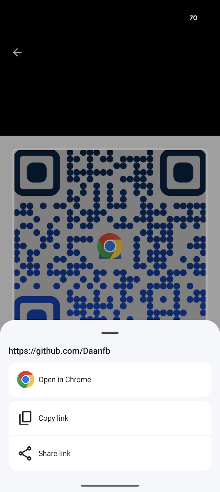 | 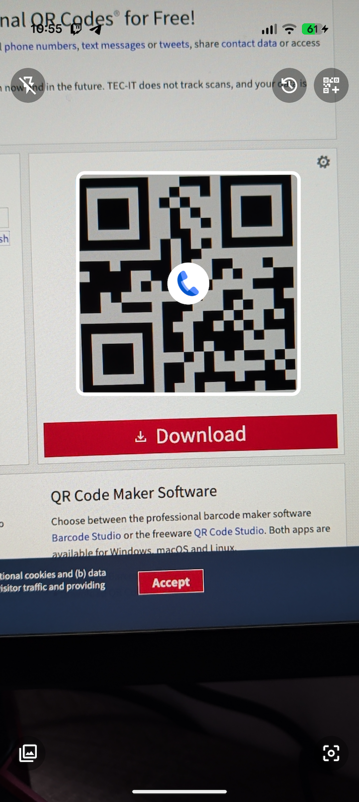 | 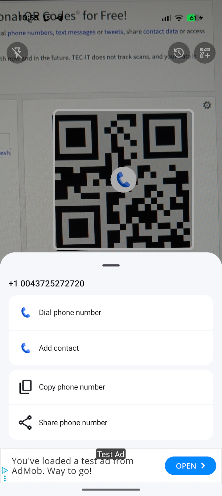 |
| **Scanned QR History** | **Created QR History** | **History URL QR Details** |
| 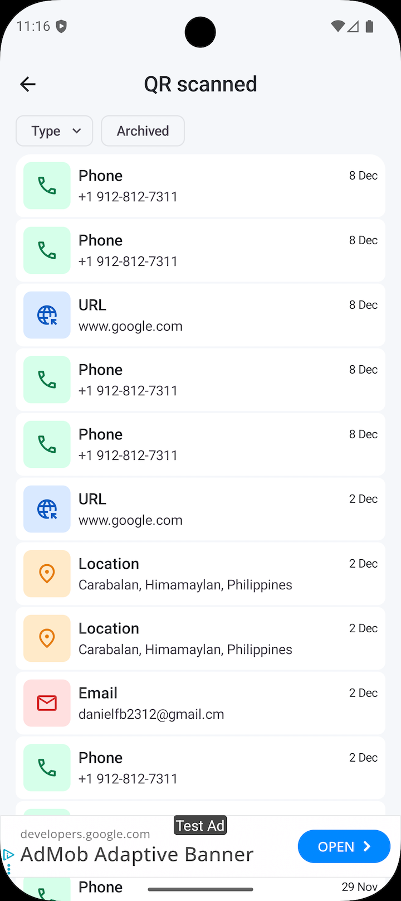 | 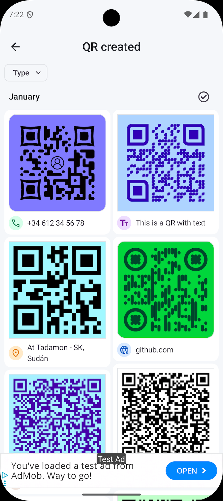 | 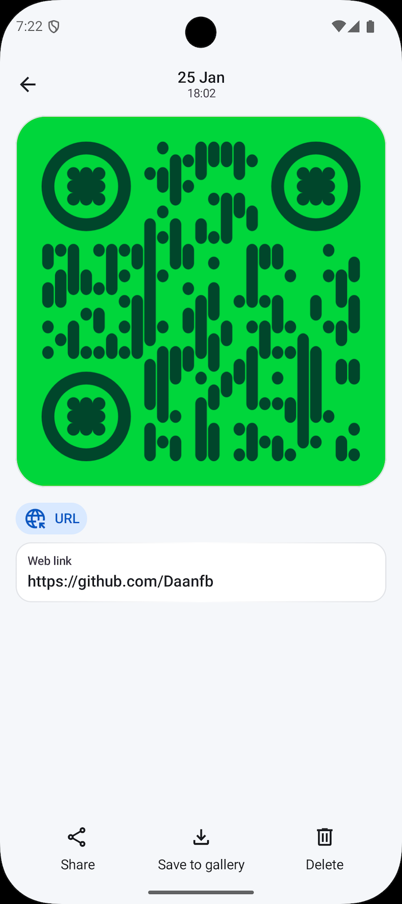 |

## 📞 Contact

**Daniel Frías** - [danielfb2312@gmail.com](mailto:danielfb2312@gmail.com) - [LinkedIn Profile](https://www.linkedin.com/in/daniel-frias-balbuena/)
